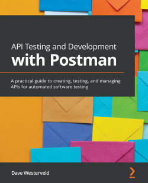

# Notes for《API Testing and Development with Postman》


## 1. Profiles



|    **Title**    | **API Testing and Development with Postman** [[buy](https://www.packtpub.com/product/api-testing-and-development-with-postman/9781800569201)] |
| :-------------: | :----------------------------------------------------------: |
|   **Author**    |                     **Dave Westerveld**                      |
| **Publication** |                      **Packt, 2021.4**                       |
|    **Pages**    |                           **341**                            |

> **Introduction**
>
> Postman enables the exploration and testing of web APIs, helping testers and developers figure out how an API works. With Postman, you can create effective test automation for any APIs. If you want to put your knowledge of APIs to work quickly, this practical guide to using Postman will help you get started.
>
> The book provides a hands-on approach to learning the implementation and associated methodologies that will have you up and running with Postman in no time. Complete with step-by-step explanations of essential concepts, practical examples, and self-assessment questions, this book begins by taking you through the principles of effective API testing. A combination of theory coupled with real-world examples will help you learn how to use Postman to create well-designed, documented, and tested APIs. You'll then be able to try some hands-on projects that will teach you how to add test automation to an already existing API with Postman, and guide you in using Postman to create a well-designed API from scratch.
>
> By the end of this book, you'll be able to use Postman to set up and run API tests for any API that you are working with.


## 2. Outlines

Status available：:heavy_check_mark: (Completed) | :hourglass_flowing_sand: (Working) | :no_entry: (Not Started) | :orange_book: (Read)

| No.  |        Chapter Title        |   Status   |
| :--: | :-------------------------: | :--------: |
| Section1 | **API Testing Theory and Terminology** |  |
| Ch01 | [API Terminology and Types](./Ch01.md) | :no_entry: |
| Ch02 | [Principles of API Design](./Ch02.md) | :no_entry: |
| Ch03 | [OpenAPI and API Specifications](./Ch03.md) | :no_entry: |
| Ch04 | [Considerations for Good API Test Automation](./Ch04.md) | :no_entry: |
| Section 2 | **Using Postman When Working with an Existing API** |  |
| Ch05 | [Understanding Authorization Options](./Ch05.md) | :no_entry: |
| Ch06 | [Creating Test Validation Scripts](./Ch06.md) | :no_entry: |
| Ch07 | [Data-Driven Testing](./Ch07.md) | :no_entry: |
| Ch08 | [Running API Tests in CI with Newman](./Ch08.md) | :no_entry: |
| Ch09 | [Monitoring APIs with Postman](./Ch09.md) | :no_entry: |
| Ch10 | [Testing an Existing API](./Ch10.md) | :no_entry: |
| Section 3 | **Using Postman to Develop an API This section** |  |
| Ch11 | [Designing an API Specification](./Ch11.md) | :no_entry: |
| Ch12 | [Creating and Using a Mock Server in Postman](./Ch12.md) | :no_entry: |
| Ch13 | [Using Contract Testing to Verify an API](./Ch13.md) | :no_entry: |
| Ch14 | [Design and Create an API](./Ch14.md) | :no_entry: |


Powershell script for generating markdown files in batch:

```powershell
# Create 14 empty markdown files named Ch##.md:
for($i=1; $i -le 14; $i=$i+1){ New-Item -Name "Ch$('{0:d2}' -f $i).md"; }
```

 
